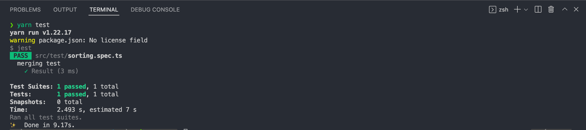

# Pre-interview form

### Setup project

set up project run 
```
yarn init 
yarn add typescript 
npx tsc --init [tsconfig-template]
```

set up testing tool run
```
yarn add @types/jest jest ts-jest
```

### run following command
```
yarn insatll
```

### For testing run
```
yarn test
```

### Result after run test

